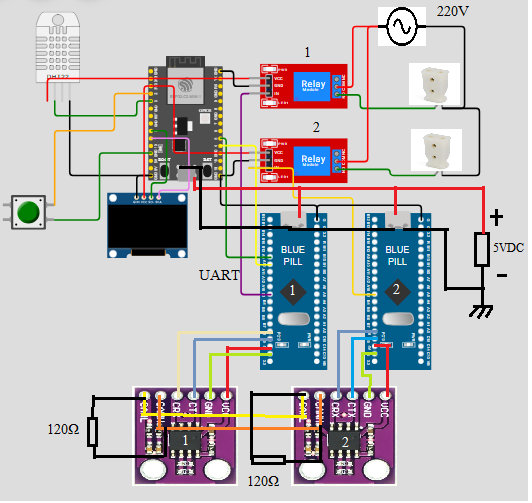
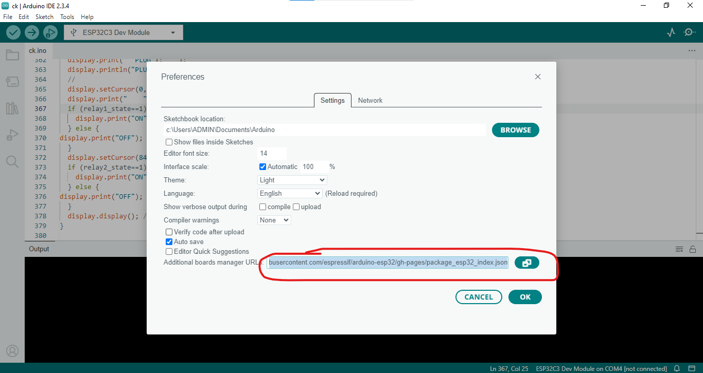
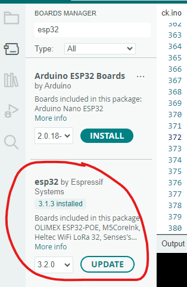
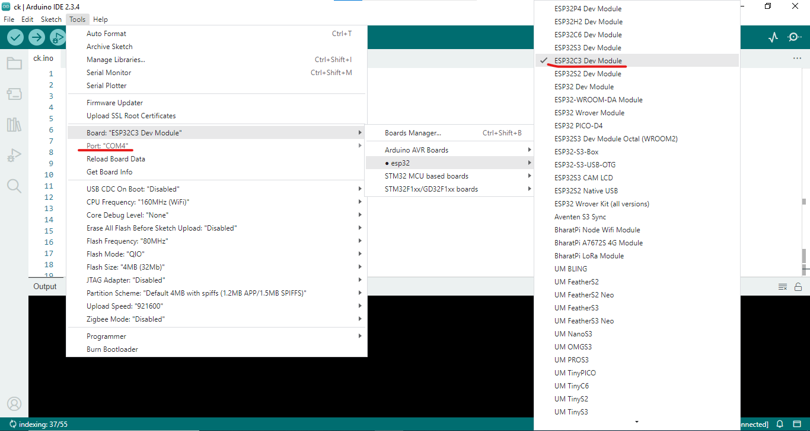
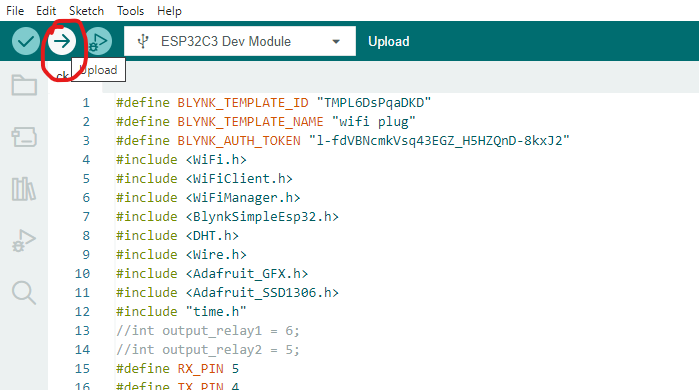
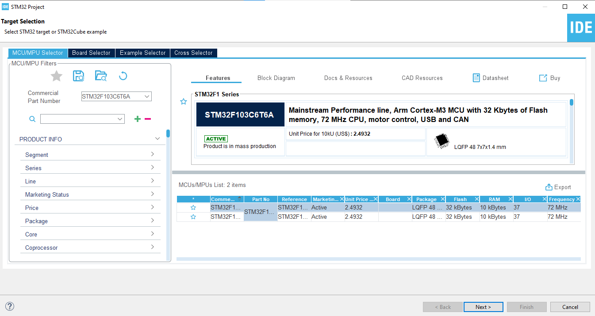
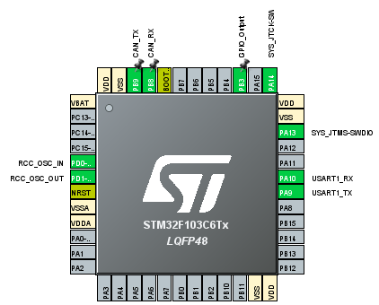
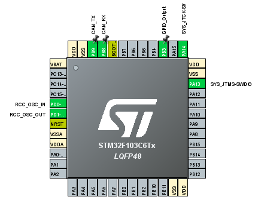

**This is midterm project about "SMART POWER OUTLET BASED ON CAN BUS" in Real-time Systems course**. 
| ID   | Student    | Class    |
|:-------:|:-------:|--------|
|106210045      | Nguyễn Văn An| 21KTMT       |
|106210050      | Phạm Thị Phương| 21KTMT       |
|106210259      | Dương Thị Thảo Vi| 21KTMT2       |

Details information midterm project, please access in Folder "Document/Slide_RTOS_midterm_report.pptx"  
Demo video: https://drive.google.com/file/d/1uJZdLKMzb7t7uUvIZkhNDOHja9ycd7Sn/view?usp=drive_link  
**Walkthrough:**  
**1. Connect the devices according to the following diagram.**  
  
**2. Install Arduino IDE and STM32CubeIDE (skip if installed)**  
Link Arduino IDE: https://www.arduino.cc/en/software  
Linh STM32CubeIDE: https://www.st.com/en/development-tools/stm32cubeide.html  
**3. Load program on Esp32-C3**  
Open Arduino IDE, open File/Preferences..., copy this link to manager URL: https://raw.githubusercontent.com/espressif/arduino-esp32/gh-pages/package_esp32_index.json (ignore if done)  
  
Install esp32 board (ignore if done)  
  
Connect Esp32-c3 to your computer. Then select board and port.  
  
Load program on Esp32-c3, source code in "esp32.ino" file  
  
**4. Load program on STM32**  
Open STM32CubeIDE, creat STM32 project, select board (STM32F103C6T6), select Location project.  
  
**STM32CubeIDE Settings on STM32 1st**  
-Click System Core/sys/select debug "Serial Wire" and select Timebase Source "TIM3"  
-Click RCC → High Speed Clock (HSE) to Crystal/Ceramic Resonator  
-Click Clock Configuration tab → HCLK (MHz) to 72  
-Click PB3 GPIO and Configuration Output state.  
-Can bus Settings:  
+Click connectivity --> Click CAN --> Mode --> Activated  
+Parameter Settings --> Prescalor 72 & Time Quanta in Bit Segment1 - 2 Times (Baud 125000)  
+Click NVIC Settings --> Choose "CAN RX1 Interrupt"  
+Set PB9 to CAN_TX (PB8 will auto set to CAN_RX)  
-FREERTOS Settings:  
+Click Middleware and Software Packs/FREERTOS/select interface "CMSIS_V1"  
+Click Advanced settings --> Choose Enabled in USE_NEWLIB_REENTRANT   
+Click Task and Queues --> Create 3 task  
(Note: Setup default task configure, exclude choose "osPriorityNormal" in Priority)  
-Click connectivity --> Click USART1 --> Mode --> Asynchronous  
  
Code will be generate "main.c" after save the setting. Copy the code in main.c (rtos_stm32_1/Core/Src/main.c) on your "main.c" project.  
Finally, load program (build and run debug) on stm32 1st with ST-LINK/V2.  
**STM32CubeIDE Settings on STM32 2nd**  
-Click System Core/sys/select debug "Serial Wire" and select Timebase Source "TIM2"  
-Click RCC → High Speed Clock (HSE) to Crystal/Ceramic Resonator  
-Click Clock Configuration tab → HCLK (MHz) to 72  
-Click PB3 GPIO and Configuration Output state.  
-Can bus Settings:  
+Click connectivity --> Click CAN --> Mode --> Activated  
+Parameter Settings --> Prescalor 72 & Time Quanta in Bit Segment1 - 2 Times (Baud 125000)  
+Click NVIC Settings --> Choose "CAN RX1 Interrupt"  
+Set PB9 to CAN_TX (PB8 will auto set to CAN_RX)  
-FREERTOS Settings:  
+Click Middleware and Software Packs/FREERTOS/select interface "CMSIS_V1"  
+Click Advanced settings --> Choose Enabled in USE_NEWLIB_REENTRANT   
+Click Task and Queues --> Create 2 task  
(Note: Setup default task configure, exclude choose "osPriorityNormal" in Priority)  
  
Code will be generate "main.c" after save the setting. Copy the code in github (rtos_stm32_2/Core/Src/main.c) on your "main.c" project.  
Finally, load program (build and run debug) on stm32 2nd with ST-LINK/V2.
